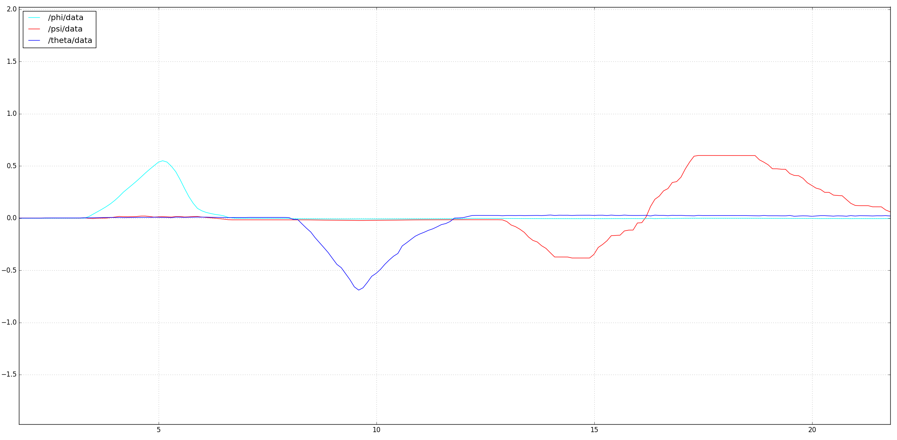

# Attitude estimation using complementary filter

This small project is a ROS package containing an implementation of a complementary filter for attitude estimation of a phone.
This could be used for some state estimation required for a robotics project.

Assumption: We assume that the sensor is on average not accelerating in translation, as if the sensor was free to rotate, but not to translate.


## Launch file

* **attitude_estimator.launch:** launches the attitude estimator as well as rviz with the urdf file of a phone


## Node

* **complementary_filter:** Initated by ```complementary_filter.py``` or ```complementary_filter_oop.py```. (same results).

#### Subscribed Topics

* **`/android/imu`** ([sensor_msgs/Imu])
	The IMU measurements

#### Published Topics

* **`/tf`** ([tf2_msgs/TFMessage])
	Lets you keep track of multiple coordinate frames over time. In this case, the tf describes the transformation between the "phone" and "world" coordinate frames.
* **`/theta`** ([std_msgs/Float32])
Euler angle theta - not used, just for plotting
* **`/phi`** ([std_msgs/Float32])
Euler angle phi - not used, just for plotting
* **`/psi`** ([std_msgs/Float32])
Euler angle psi - not used, just for plotting


## Building

To build from source, clone the latest version from this repository into your catkin workspace and compile the package using

	cd catkin_workspace/src
	git clone https://github.com/mattia-pelissou/Attitude_estimation.git
	cd ../
	catkin_make

## Usage
The IMU data has been acquired using a samsung galaxy S6 and the android sensors driver that converts the data into ros topics, so to launch the android sensor driver please read: http://wiki.ros.org/android_sensors_driver/Tutorials/Connecting%20to%20a%20ROS%20Master

```python
cd catkin_workspace/
source devel/setup.bash
roslaunch attitude_estimator attitude_estimator.launch
```
## Some results



## References
1. [Reading a IMU Without Kalman](https://www.pieter-jan.com/node/11)
2. [Complementary filter design](https://gunjanpatel.wordpress.com/2016/07/07/complementary-filter-design/)
3. [Tilt Sensing Using a Three-Axis Accelerometer](https://www.nxp.com/docs/en/application-note/AN3461.pdf)
4. [Open source IMU and AHRS algorithms](https://x-io.co.uk/open-source-imu-and-ahrs-algorithms/)
5. Manon Kok, Jeroen D. Hol and Thomas B. Sch ̈on (2017), ”Using Inertial Sensors for Position andOrientation Estimation”, Foundations and Trends in Signal Processing: Vol.  11: No.  1-2, pp 1-153.http://dx.doi.org/10.1561/2000000094
